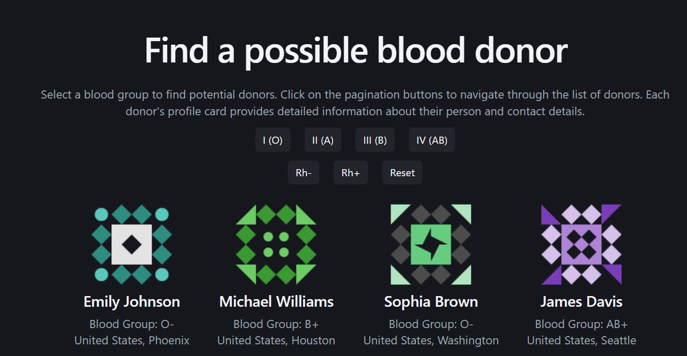
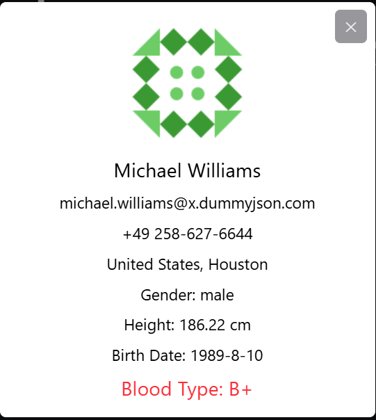

# 🩸 Users Dashboard — Blood Donor Finder

Приложение для поиска потенциальных доноров крови с фильтрацией, пагинацией и просмотром детальной информации о пользователе.

---

## 🚀 Demo




---

## 📦 Установка и запуск

```bash
git clone <your-repo-url>
cd users-dashboard
npm install
npm run dev
```

Открыть в браузере:
http://localhost:5173

---

## 🛠️ Технологии

- React 19
- TypeScript
- Vite
- TailwindCSS

---

## ✨ Основной функционал

- 🔍 Фильтрация пользователей по группе крови
- 📄 Пагинация списка
- 👤 Просмотр детальной информации (модальное окно)
- ⏳ Состояния загрузки и ошибки
- ⚡ Кеширование запросов (client-side)

---

## 🧠 Архитектурные решения

### 1. Кастомный хук `useUsersList`

Вся логика работы с API (загрузка, пагинация, фильтрация, состояния) инкапсулирована в отдельный хук.

**Почему:**

- разделение ответственности (UI ≠ data logic)
- переиспользуемость
- упрощение тестирования и поддержки

---

### 2. Пагинация через `limit/skip`

Используется классический подход:

- `limit` — количество элементов на страницу
- `skip` — смещение

```ts
const skip = (page - 1) * LIMIT_PER_PAGE;
```

**Почему:**

- соответствует REST API best practices
- легко масштабируется
- не требует хранения всех данных на клиенте

---

### 3. Кеширование запросов

Реализовано через `useRef` внутри хука.

**Как работает:**

- ключ кеша: `page + filter`
- при повторном запросе данные берутся из памяти без `fetch`

**Почему:**

- уменьшает количество сетевых запросов
- ускоряет навигацию между страницами
- улучшает UX

---

### 4. Модальное окно через `createPortal`

Модалка рендерится в `document.body`.

**Почему:**

- избегаем проблем с `z-index`
- изоляция от layout родительских компонентов
- стандартный подход для overlay UI

---

### 5. Обработка состояний

Реализованы:

- `loading`
- `error`
- `empty state`

**Почему:**

- предсказуемый UX
- отсутствие “прыгающего” интерфейса
- корректная обработка edge-case сценариев

---

## 📁 Структура проекта

```
src/
 ├── components/        # UI компоненты
 ├── hooks/             # бизнес-логика (useUsersList)
 ├── utils/             # утилиты (формирование URL)
 ├── types&interfaces/  # типы
 ├── App.tsx
 └── main.tsx
```

---

## ⚙️ Работа с API

URL формируется через утилиту:

```
src/utils/getURL.ts
```

Параметры:

- `limit`
- `skip`
- `filter`

---

## 🎯 Возможные улучшения

Если бы проект развивался дальше, можно было бы улучшить следующие моменты:

- подключение TanStack Query для управления серверным состоянием
- добавление анимаций (модалка, список)
- сохранение состояния в URL (query params)
- infinite scroll вместо пагинации
- виртуализация списка
- unit / integration тесты

---

## 🧪 Edge Cases

Учтены сценарии:

- пустой результат поиска
- ошибка API
- быстрая смена фильтров (AbortController)
- повторные запросы (кеширование)

---
